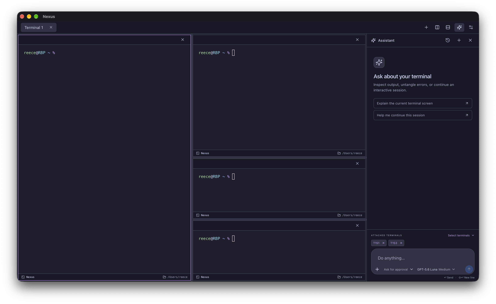
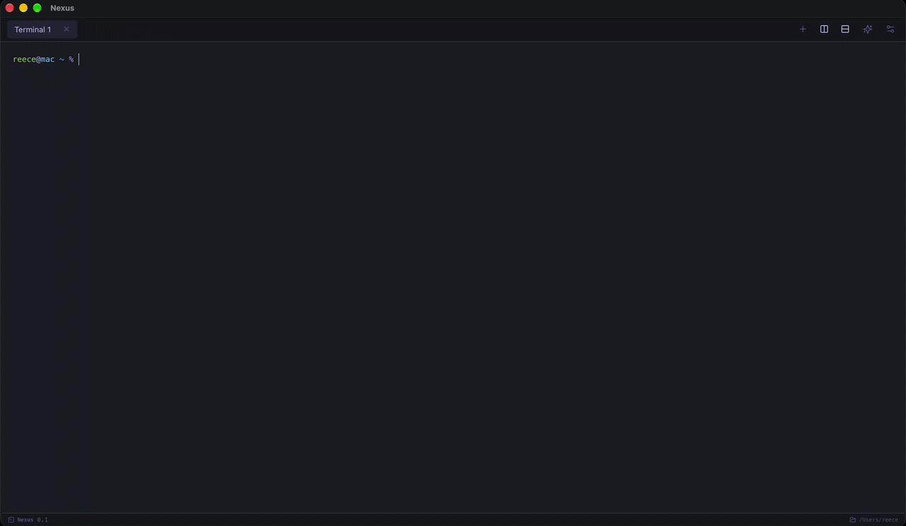
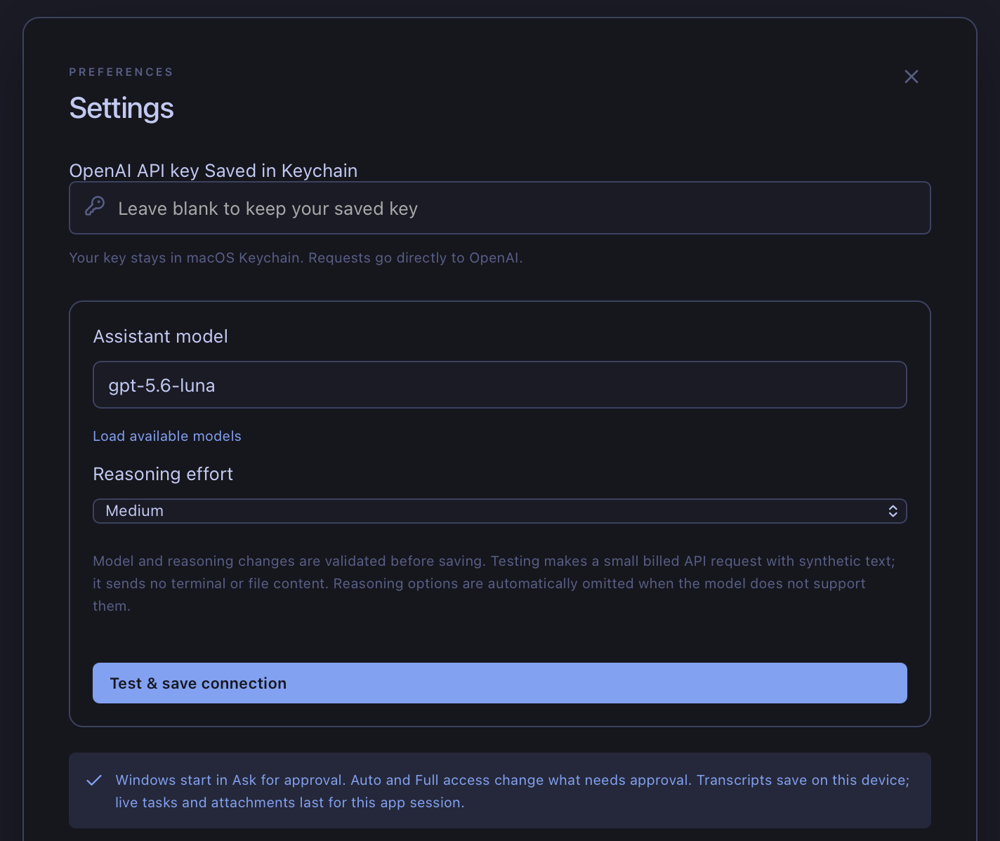
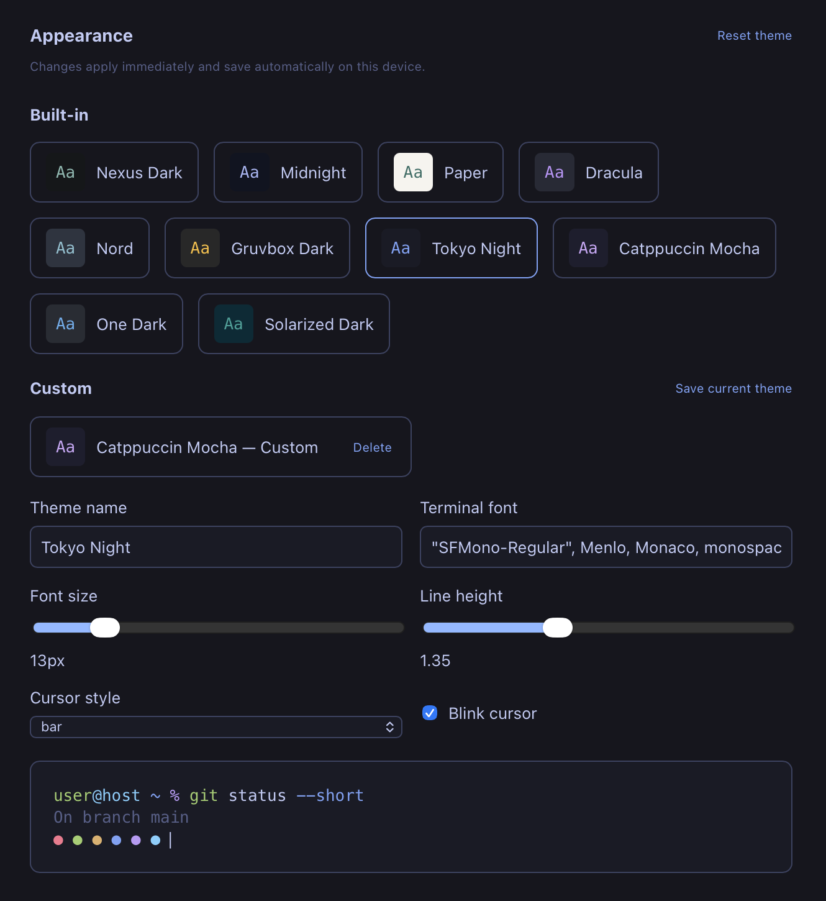

# Nexus

_A macOS terminal with a window-level AI assistant._

Nexus brings an AI agent directly into your terminal workflow. Press **Cmd+J**, attach terminal panes, and ask the agent to inspect or work within your live shells, SSH sessions, and interactive applications such as Vim and less. Each window has one assistant, with its own conversation, attachments, and permission mode.



Split your workspace and choose which terminal sessions the assistant can use—even across tabs.

## Demo



## Features

- **Integrated AI Assistant**: Seamlessly switch between chat and your terminal to get help, run commands, or inspect output.
- **Multi-pane & Multi-tab Interface**: Flexible layouts with intuitive keyboard shortcuts for splitting, navigating, and organizing your workspace.
- **Granular Permissions**: Maintain full control over what the AI can execute with configurable permission modes (Ask for approval, Approve for me, Full access).
- **Live Context Awareness**: The agent understands your current terminal state, including visible screen, cursor position, and recent scrollback.
- **Scoped Local Context**: API keys stay in your macOS Keychain. Optional local directory attachments enable scoped file reads.
- **Automatic Redaction**: Sensitive credentials and common personal identifiers are redacted before context is sent to the AI assistant. This protection can be toggled in Settings.
- **Customizable Appearance**: Built-in themes, saved custom themes, terminal fonts, cursor options, and editable UI and terminal colors. Import or export themes as JSON.
- **Local Chat History**: Reopen saved conversations on this device. Live tasks and terminal attachments last for the app session.
- **Custom Keyboard Shortcuts**: Remap shortcuts in Settings; bindings persist across launches.

## Installation & First Use

Requires **macOS 12 or later**, on Apple Silicon or Intel. Node.js, Rust, and Xcode are needed only when building from source.

1. **Download**: Check [Releases](https://github.com/reecehunter/Nexus/releases) for a DMG matching your Mac's processor. If no installer is available, use the source-build instructions below.
2. **Install**: Open the DMG and drag Nexus to your Applications folder.
3. **Configure**: Launch Nexus and press **Cmd+,** to open Settings. Enter your OpenAI API key, select a model available to your account, and choose its reasoning effort where supported.
4. **Test & Save**: Click **Test & save connection** to validate your credentials. This makes a small billed API request with synthetic text; it sends no terminal or file content.

The terminal works without an API key. The assistant requires your own key, stored in macOS Keychain, and sends requests directly to OpenAI.



### Your first conversation

1. Press **Cmd+J** to open the assistant. By default, it uses the focused terminal pane.
2. Use **Select terminals** to choose the sessions you want to attach. Optionally attach a local directory for file context.
3. Ask a question, such as “Explain the current terminal screen” or “Help me continue this session.”
4. Review proposed actions in **Ask for approval**, the default mode for each new window.

Typing in an attached terminal during agent work pauses the agent; use **Resume** to continue the task. **Stop** pauses agent work without interrupting a running terminal job; use an explicit interrupt to stop the foreground command.

### Upgrading

Quit Nexus before replacing the application with a newer release. Settings, themes, Keychain credentials, and local transcripts are preserved. Live terminal sessions and agent tasks end when the app quits.

## Appearance

Choose from ten built-in themes, including Nexus Dark, Paper, Dracula, Nord, Tokyo Night, and Catppuccin Mocha. Adjust the terminal font, font size, line height, cursor style, and colors; save custom themes or import and export theme JSON. Appearance changes apply immediately and save automatically on this device.



## Keyboard Shortcuts

These are the default bindings. Customize them in **Settings → Keyboard shortcuts**.

| Shortcut                  | Action                                               |
| ------------------------- | ---------------------------------------------------- |
| `Cmd+T`                   | Create a terminal tab                                |
| `Cmd+N`                   | Create an independent window                         |
| `Cmd+W`                   | Close the focused session                            |
| `Cmd+Shift+W`             | Close the current window                             |
| `Cmd+D`                   | Split the focused session side by side               |
| `Cmd+Shift+D`             | Split the focused session top and bottom             |
| `Cmd+1` … `Cmd+9`         | Select a tab by its current position                 |
| `Cmd+Option+/`            | Cycle through panes in the selected tab              |
| `Cmd+Option+[ / ]`        | Cycle through panes in the selected tab              |
| `Cmd+Option+arrows`       | Focus a pane in that direction                       |
| `Cmd+,`                   | Open Settings                                        |
| `Cmd+J`                   | Toggle chat and move focus between chat and terminal |
| `Escape`                  | Close chat and focus the terminal                    |
| `Enter` _(in chat)_       | Send a question                                      |
| `Shift+Enter` _(in chat)_ | Insert a newline                                     |
| `Cmd+C` / `Cmd+V`         | Copy selected terminal text / paste                  |
| `Ctrl+C` _(in terminal)_  | Interrupt the foreground command                     |

## Permissions & Security

Nexus enforces strict, transparent permission boundaries for the AI agent. Each window operates with its own permission mode:

- 🛡️ **Ask for approval** _(Default)_: Automatically inspects the terminal, but explicitly asks before sending any input or running local commands.
- 🤝 **Approve for me**: Automatically allows recognized, conservative inspection and navigation. Prompts for uncertain commands, script execution, edits, or consequential input.
- 🚀 **Full access**: Sends input and runs commands without approval, utilizing the attached session's privileges.

### Context and privacy

- When you send a question, attached terminal screens and recent output, your messages, and requested local file/tool results are sent to OpenAI. Attach only the sessions and directories you intend to share.
- Scoped local file tools and the local command runner exclude credential paths such as `.env*`, `.ssh`, `.aws`, and common private key formats. Terminal actions still operate with the attached session's privileges.
- Remote SSH contexts are handled safely; automated actions pause for human authentication prompts.
- AI requests use `store: false`; provider retention still depends on your OpenAI data controls.
- Automatic redaction is enabled by default and can be toggled in Settings. It covers detected credentials, provider keys, private keys, email addresses, phone numbers, Social Security numbers, and credit-card numbers before provider requests. Detection is not a guarantee that every sensitive value will be removed.

## Development & Building from Source

### Prerequisites

- macOS 12+
- Node.js 22.12+ (Node 24 recommended)
- Rust 1.90+
- Xcode Command Line Tools

### Setup

```sh
npm ci
npm run app:dev
```

### Building

To create a local application bundle (targets your build machine's architecture):

```sh
npm run app:build
open "src-tauri/target/release/bundle/macos/Nexus.app"
```

For signed and notarized releases, run `npm run app:release` using the credentials detailed in [RELEASING.md](docs/RELEASING.md).

## Architecture & Structure

Nexus is split into a desktop frontend and a native backend. React and xterm.js
render the application and terminal UI; the frontend communicates with the
native runtime only through the typed `Backend` contract in `src/backend.ts`.
The current Tauri adapter is isolated in `src/platform/tauri-backend.ts`, while
Rust owns real PTY sessions and the agent tool loop.

- **`src/`**: React UI, xterm.js integration, runtime-neutral backend contract, Tauri adapter, window-level agent, and request-scoped chat state.
- **`src-tauri/src/terminal.rs`**: PTY lifecycle, flow control, and native macOS directory tracking.
- **`src-tauri/src/chat.rs` & `permissions.rs`**: OpenAI terminal tool loop, in-memory history, conservative permission policy, and single-use approvals.
- **`src-tauri/src/context.rs` & `runner.rs`**: Scoped reads, task processes, SSE decoding, and Keychain/settings access.

## Testing & Verification

Run the automated checks:

```sh
npm run check
npm run test:release
cargo test --manifest-path src-tauri/Cargo.toml
cargo clippy --manifest-path src-tauri/Cargo.toml --all-targets -- -D warnings
```

The Rust suite includes a mock API server and robust real PTY/process tests covering file inspection, output limits, Unicode handling, timeouts, and more. _No real API key or paid calls are required for automated tests._

### Multi-session Smoke Test

Create two tabs and split one right, then split its focused pane down. Confirm there is only one assistant panel and draft per window. Attach panes across both tabs, switch focus, and verify customized attachments stay fixed. Resize splits and close a pane; confirm remaining terminals keep their output and lost attachments disappear. Restart an attached shell and confirm its replacement requires selection again. Create a second OS window and confirm conversations, attachments, and modes are independent. Check `Cmd+T`, `Cmd+N`, `Cmd+W`, `Cmd+Shift+W`, `Cmd+1–9`, and pane shortcuts. Confirm custom Settings shortcuts work in both windows and persist after relaunch.

### Agent Smoke Test

_(Uses your API key)_ In a disposable directory, ask the agent to inspect the terminal and run `pwd`; verify **Ask** requests approval and **Auto** approves only recognized routine inspection. Reject an edit and confirm nothing is sent. Change output or resize while an approval is pending and confirm the stale action is rejected. In **Full**, try navigating `less README.md` and editing a disposable file in Vim. Type manually during agent work and confirm it pauses; **Resume** must retain the original task. Run a long job and confirm Stop leaves it running until explicit Interrupt. Attach an existing SSH session and confirm commands target that session, remote paths are never presented as local context, and authentication pauses for human entry. No automated test needs real SSH credentials or a paid API call.
